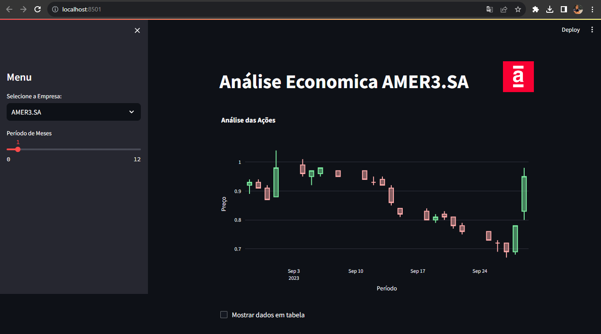

# python-stock-analysis

Esta documentação tem como objetivo apresentar a arquitetura do serviço **"python-stock-analysis"**, de forma clara e objetiva, a fim de simplificar a compreensão de todos os seus componentes e funcionamento. Esse serviço é responsável por fornecer soluções em Business Intelligence, atendendo os interessados na análises da bolsa de valores.

O objetivo do código é coletar os dados da API Yahoo Finance e exibi-los no gráfico Box Plot em uma página Web. Para este feito é necessário a utilização das Libs abaixo:
* StreamLit;
* Pandas;
* Numpy;
* plotly.graph_objects;
* plotly.subplots;
* yfinance

---

---
# Passos para implementar a solução:

1. Crie uma pasta nova para o projeto;

2. Certifique que o Python está instalado ( cmd -> Python);

3. Rode o comando no cmd ( pip install virtualenv ) para instalar os
requisitos para um ambiente virtual;

4. Navegue até a pasta que foi criada (cd C:\path\project)

5. Rode o comando para criar um Ambiente Virtual 
(python -m venv Ambiente_Virtual)

6. Acesse a pasta Scripts
( cd C:\path\project\Ambiente_Virtual\Scripts)

7. Ative o ambiente virtual ( C:\path\project\Ambiente_Virtual\Scripts> ( activate )

8. Digite ( cd.. ) para regredir uma pasta e volte para o Projeto
( C:\path\project> )

9. Instale o pacote do streamlit ( pip install streamlit )

**RESTANTE PODE SER FEITO NO VS CODE** 

10.  Abra a solução no Vs Code

11. Instale as bibliotecas ( pip install lib )

12. Para rodar o projeto, digite
( C:\path\project> streamlit run app.py)

- 

---
---
---
---
---

# python-stock-analysis

This documentation aims to present the architecture of the **"python-stock-analysis"** service in a clear and concise manner, with the goal of simplifying the understanding of all its components and functionality. This service is responsible for providing Business Intelligence solutions, catering to those interested in stock market analysis.

The purpose of the code is to collect data from the Yahoo Finance API and display it in a chart on a web page. To achieve this, the following libraries are necessary:
- StreamLit
- Pandas
- Numpy
- plotly.graph_objects
- plotly.subplots
- yfinance

## Steps to Implement the Solution:

1. Create a new folder for the project;
2. Ensure that Python is installed (cmd -> Python);
3. Run the command in the cmd (`pip install virtualenv`) to install the requirements for a virtual environment;
4. Navigate to the created folder (`cd C:\path\project`);
5. Run the command to create a virtual environment (`python -m venv Virtual_Environment`);
6. Access the `Scripts` folder (`cd C:\path\project\Virtual_Environment\Scripts`);
7. Activate the virtual environment (`C:\path\project\Virtual_Environment\Scripts> activate`);
8. Type (`cd..`) to go back one folder and return to the project (`C:\path\project>`);
9. Install the streamlit package (`pip install streamlit`);

**THE REST CAN BE DONE IN VS CODE**

10. Open the solution in Vs Code;
11. Install the libraries (`pip install lib`);
12. To run the project, type (`C:\path\project> streamlit run app.py`);

- 